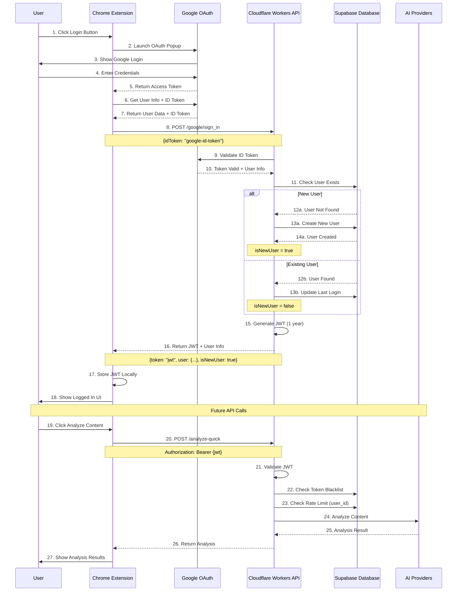
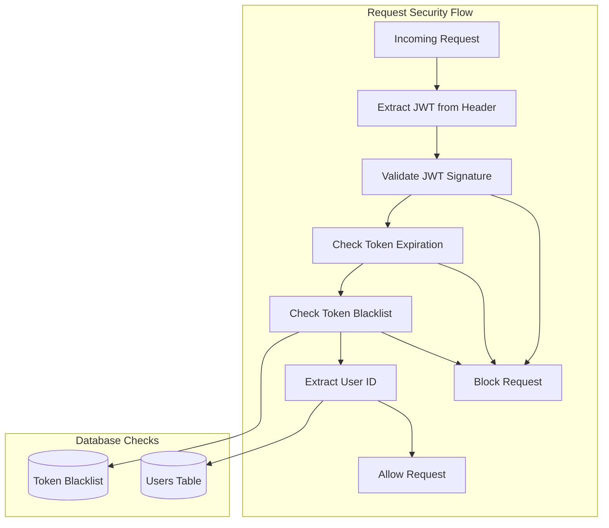
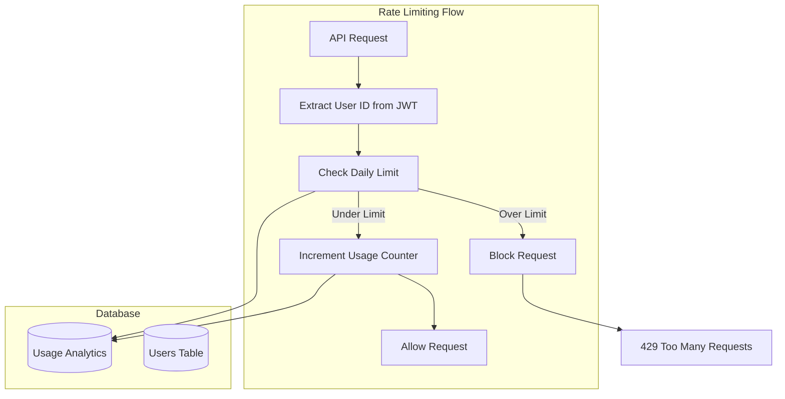
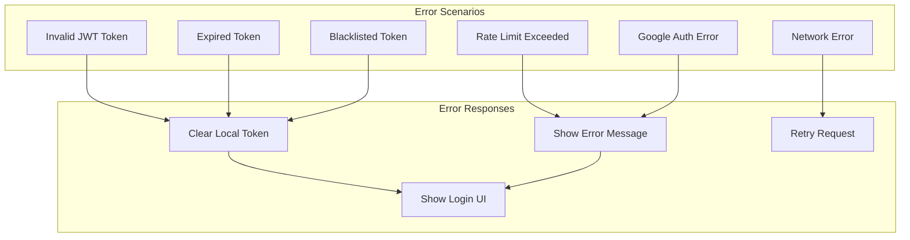

# OAuth Flow: Chrome Extension to Backend

## Overview
This document explains the complete OAuth flow from Chrome extension to backend, using Google OAuth 2.0 with ID tokens and long-lived JWT tokens.

## Complete OAuth Flow



## Token Management Flow

```mermaid
graph TD
    subgraph "Chrome Extension Token Management"
        Login[User Login]
        StoreToken[Store JWT in Chrome Storage]
        GetToken[Get Token for API Calls]
        ValidateToken[Validate Token Locally]
        ClearToken[Clear Token on Logout]
    end
    
    subgraph "Backend Token Management"
        GenerateJWT[Generate JWT (1 year)]
        ValidateJWT[Validate JWT Signature]
        CheckBlacklist[Check Token Blacklist]
        BlacklistToken[Add Token to Blacklist]
    end
    
    subgraph "Database"
        Users[(Users Table)]
        Blacklist[(Token Blacklist)]
    end
    
    Login --> GenerateJWT
    GenerateJWT --> StoreToken
    GetToken --> ValidateJWT
    ValidateJWT --> CheckBlacklist
    CheckBlacklist --> Blacklist
    ClearToken --> BlacklistToken
    BlacklistToken --> Blacklist
```

## Security Flow



## Rate Limiting with User ID




## Error Handling Flow



## Implementation Steps

### Step 1: Chrome Extension Setup
1. **Manifest Configuration**
   - Add OAuth2 permissions
   - Configure Google client ID
   - Set up identity API

2. **Google OAuth Handler**
   - Launch OAuth popup
   - Handle access token
   - Get ID token from Google

3. **Token Storage**
   - Store JWT securely
   - Handle token expiration
   - Clear tokens on logout

### Step 2: Backend Authentication
1. **Google Token Validation**
   - Verify ID token with Google
   - Extract user information
   - Handle validation errors

2. **User Management**
   - Check if user exists
   - Create new users
   - Update login timestamps

3. **JWT Generation**
   - Generate 1-year tokens
   - Include user information
   - Set proper claims

### Step 3: Security Implementation
1. **Token Blacklisting**
   - Store hashed tokens
   - Check blacklist on requests
   - Clean up expired tokens

2. **Rate Limiting**
   - Use user ID for limits
   - Track daily usage
   - Handle limit exceeded

3. **Error Handling**
   - Network failures
   - Authentication errors
   - Rate limit errors

## Security Considerations

### Token Security
- **Long-lived tokens**: 1-year expiration for better UX
- **Blacklisting**: Revoke tokens on logout
- **Secure storage**: Use Chrome's secure storage APIs
- **Validation**: Check signature, expiration, and blacklist

### Data Privacy
- **Minimal data**: Only store necessary user information
- **GDPR compliance**: Allow data deletion
- **Secure transmission**: HTTPS for all communications

### API Security
- **CORS policies**: Proper cross-origin handling
- **Request validation**: Validate all inputs
- **Rate limiting**: Prevent abuse

## Benefits of This Approach

1. **User Experience**
   - One-click Google login
   - Long-lived sessions (1 year)
   - Seamless authentication

2. **Security**
   - Server-side token validation
   - Token blacklisting for logout
   - Rate limiting per user

3. **Scalability**
   - Stateless JWT tokens
   - No session storage needed
   - Global edge network

4. **Maintenance**
   - Simple token management
   - Easy to debug
   - Clear error handling

## Monitoring and Analytics

### Authentication Metrics
- Login success rate
- Token validation success rate
- Blacklisted token count
- User retention after login

### Performance Metrics
- Authentication response time
- Token validation latency
- Rate limiting effectiveness
- Cache hit rates

### Security Metrics
- Failed authentication attempts
- Invalid token requests
- Rate limit violations
- Token blacklist size 