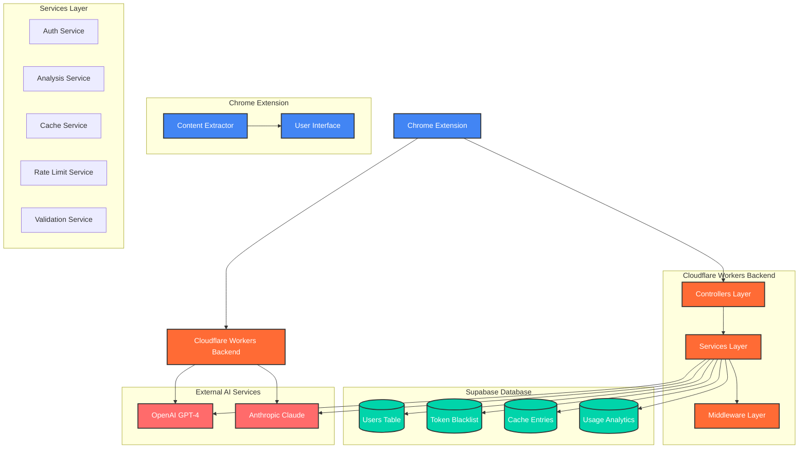
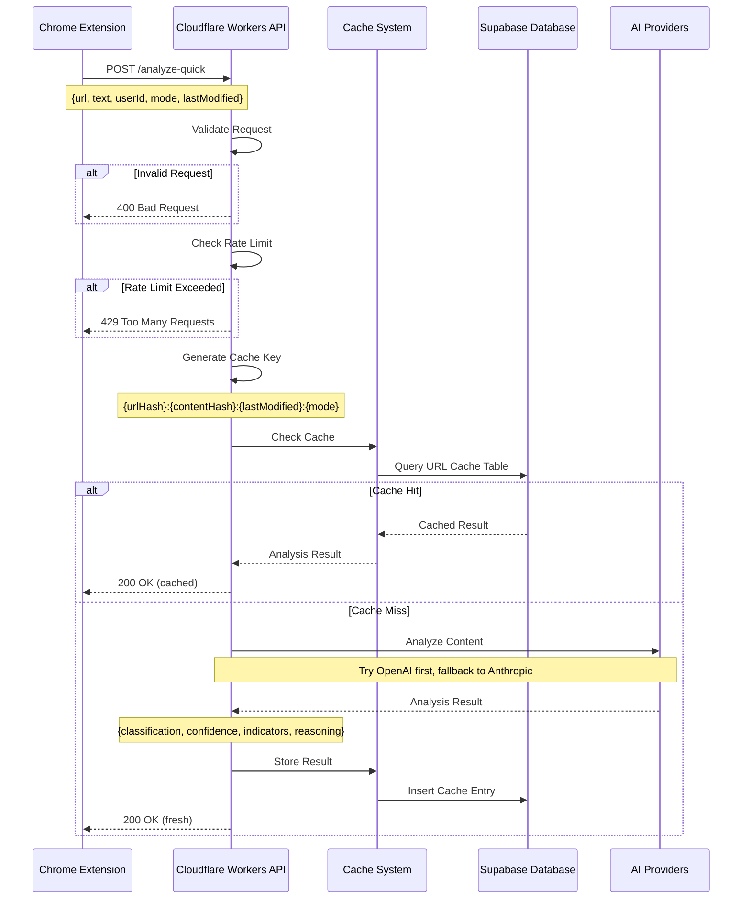
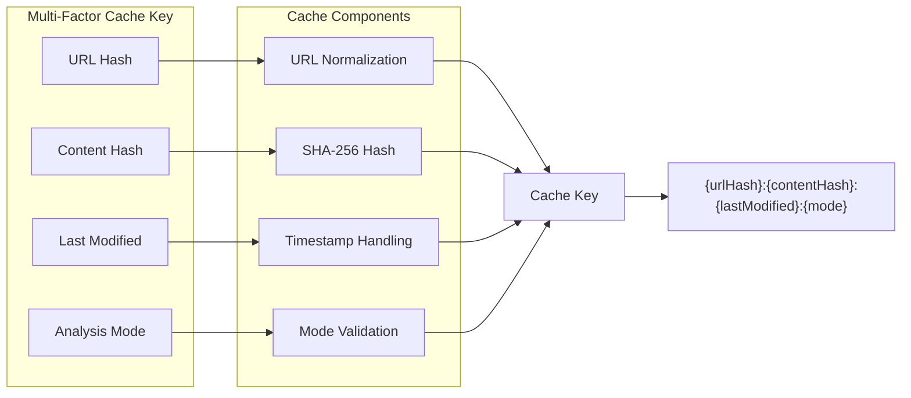
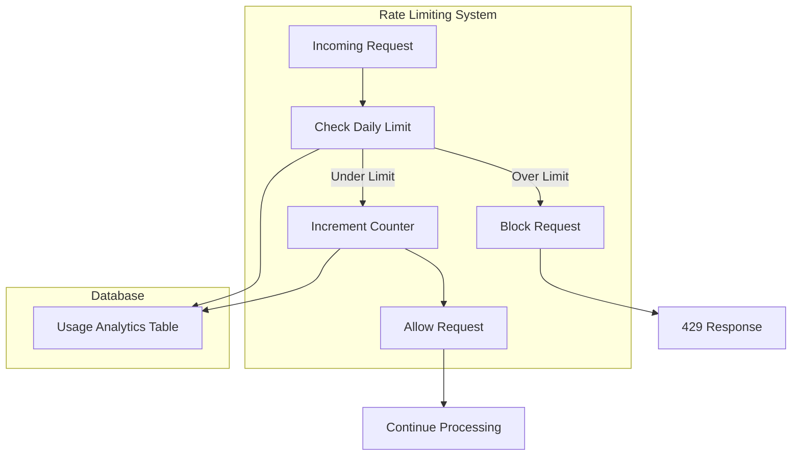

# AI Slop Detector

A Chrome extension that detects AI-generated content using advanced machine learning analysis. The system consists of a Chrome extension frontend and a Cloudflare Workers backend API.

## System Architecture



## Request Flow



## Cache Strategy



## Rate Limiting



## Features

### Chrome Extension
- **Content Extraction**: Automatically extracts text content from web pages
- **Real-time Analysis**: Instant AI detection with confidence scores
- **User-friendly Interface**: Clean, intuitive UI with detailed results
- **Privacy-focused**: No content storage, only cryptographic hashes

### Backend API
- **Layered Architecture**: Controllers, Services, and Middleware with clear separation of concerns
- **Authentication**: Google OAuth integration with JWT tokens
- **Multi-Provider AI Analysis**: OpenAI GPT-4 and Anthropic Claude with automatic fallback
- **Intelligent Caching**: Multi-factor cache strategy with content change detection
- **Rate Limiting**: Daily limits (50 analyses/day) with authenticated user tracking
- **Global Edge Network**: Sub-100ms response times worldwide
- **TypeScript**: Full type safety and modern development experience

### Database
- **Users Table**: Stores authenticated user information
- **Token Blacklist**: Tracks invalidated JWT tokens for security
- **Cache Entries**: Stores analysis results with composite unique indexes
- **Usage Analytics**: Tracks daily usage for rate limiting
- **Row Level Security**: Database-level access controls
- **Real-time Capabilities**: Supabase real-time features

## Technology Stack

- **Frontend**: Chrome Extension (JavaScript)
- **Backend**: Cloudflare Workers (TypeScript)
- **Database**: Supabase (PostgreSQL)
- **AI Providers**: OpenAI GPT-4, Anthropic Claude
- **Caching**: Multi-factor cache strategy
- **Rate Limiting**: Daily limits with abuse prevention

## Security & Privacy

- **HTTPS Everywhere**: All communications encrypted
- **No Content Storage**: Only cryptographic hashes stored
- **Authenticated Users**: Google OAuth with secure JWT tokens
- **Environment Variables**: Sensitive configuration isolated
- **Row Level Security**: Database-level access controls

## Performance

- **Global Edge Network**: Sub-100ms response times
- **Intelligent Caching**: 90%+ cache hit rates
- **Fallback Strategy**: Automatic provider switching
- **Optimized Requests**: First 500 words analysis
- **Compression**: Efficient data transfer

## Getting Started

### Prerequisites
- Node.js 18+
- Chrome browser
- Supabase account
- OpenAI API key
- Anthropic API key

### Installation

1. **Clone the repository**:
   ```bash
   git clone https://github.com/your-username/ai-slop-detector.git
   cd ai-slop-detector
   ```

2. **Backend Setup**:
   ```bash
   cd backend
   npm install
   ```

3. **Configure environment variables**:
   Create a `.dev.vars` file:
   ```env
   SUPABASE_URL=your-supabase-url
   SUPABASE_ANON_KEY=your-supabase-anon-key
   OPENAI_API_KEY=your-openai-api-key
   ANTHROPIC_API_KEY=your-anthropic-api-key
   JWT_SECRET=your-jwt-secret
   GOOGLE_CLIENT_ID=your-google-client-id
   ```

4. **Set up database**:
   Run the SQL scripts in `backend/database/schema.sql`

5. **Deploy backend**:
   ```bash
   npm run deploy
   ```

6. **Chrome Extension Setup**:
   - Open Chrome and go to `chrome://extensions/`
   - Enable "Developer mode"
   - Click "Load unpacked" and select the extension directory
   - Configure the backend URL in the extension settings

## API Documentation

### POST /analyze-quick

Analyzes content to determine if it's AI-generated or human-written.

**Request Body**:
```json
{
  "url": "https://example.com/article",
  "text": "The first 500 words of content to analyze...",
  "userId": "anonymous-user-id",
  "mode": "quick",
  "lastModified": "2024-01-15T10:30:00Z"
}
```

**Response**:
```json
{
  "classification": "ai-generated",
  "confidenceLevel": "high",
  "confidenceScore": 0.85,
  "keyIndicators": ["repetitive patterns", "formal tone"],
  "reasoning": "The text exhibits characteristics typical of AI-generated content...",
  "metadata": {
    "wordCount": 450,
    "provider": "openai",
    "analysisTime": 1250
  },
  "cacheStatus": "miss"
}
```

## Contributing

1. Fork the repository
2. Create a feature branch
3. Make your changes with proper TypeScript types
4. Add tests for new functionality
5. Submit a pull request

## License

MIT License - see LICENSE file for details.
